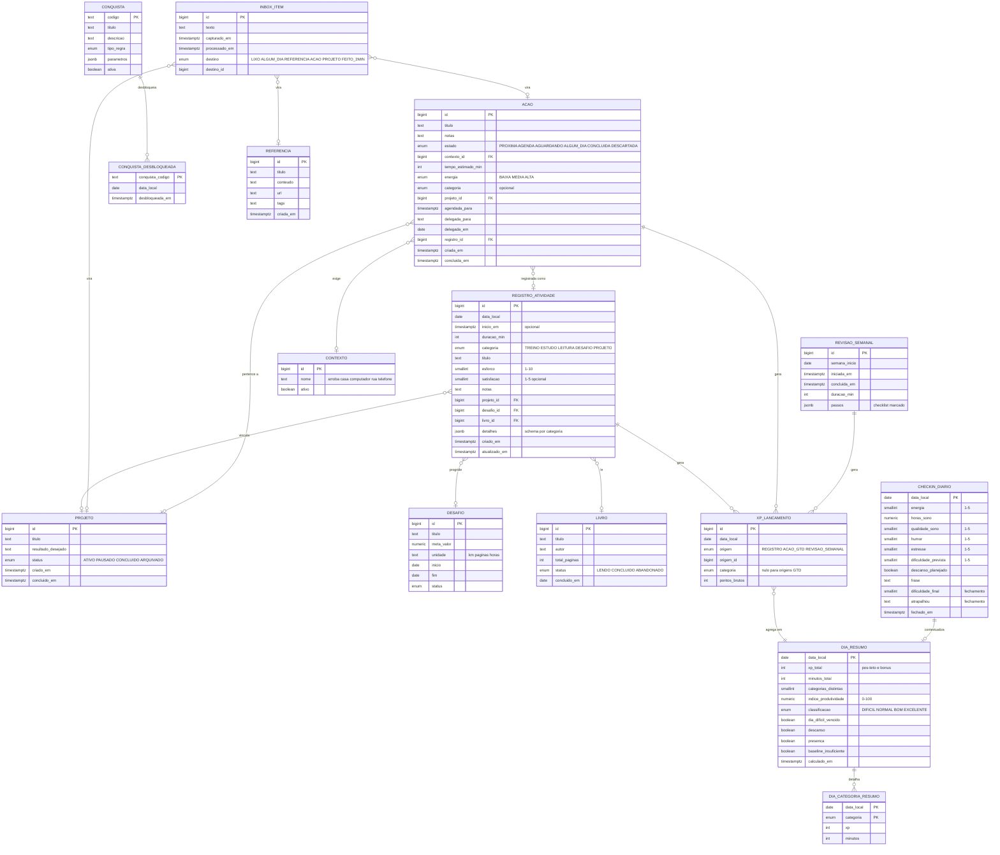

# Plano — Sistema de Registro de Atividades + GTD

Status: **todas as 5 fases concluídas.** O sistema está completo conforme o plano; o que ficou de fora está na seção 6.

---

## 1. Decisões de design

### 1.1 Autenticação — `quarkus-elytron-security-properties-file`

Usuário fixo `admin` com a senha vinda de `APP_PASSWORD` (`.env`), form auth com cookie de sessão
(`registro_sessao`, 7 dias). Não há tabela de usuário, migration de usuário, tela de cadastro nem
recuperação de senha — infra que existiria para gerenciar exatamente uma linha que nunca muda.

A senha fica em texto claro no `.env` em vez de bcrypt: o hash protegeria contra o vazamento de um
banco que aqui não existe, e quem lê o `.env` já tem a senha de qualquer forma. As páginas de form
auth ficam vazias de propósito — assim o Quarkus responde 401/200 em vez de redirecionar, que é o que
uma SPA consegue tratar.

Todos os endpoints ficam sob `@RolesAllowed("user")`; nada no código de domínio conhece o usuário.
Quando (se) virar multiusuário, troca-se o identity provider por `security-jpa` e adiciona-se
`usuario_id` às tabelas — os resources não mudam.

### 1.2 XP é um ledger, não um campo

XP vem de três origens (registro de atividade, ação GTD concluída, revisão semanal). Em vez de cada
módulo manter seu próprio contador, todos escrevem em `xp_lancamento` (data local, origem, pontos
**brutos**, categoria). Tetos, bônus e totais são derivados desse ledger.

Consequência: editar ou excluir um registro é só reescrever seus lançamentos e recalcular o dia. E
"de onde veio meu XP nesse dia?" é uma query, não uma reconstrução.

### 1.3 O dia é materializado

`dia_resumo` e `dia_categoria_resumo` guardam XP, minutos, índice e classificação de cada dia,
recalculados por evento (salvar/editar/excluir registro ou check-in) e reconciliados por um job
diário às 03:10. Sem isso, renderizar o heatmap anual seriam 365 recálculos com janela móvel de 28
dias cada.

O recálculo de um dia D afeta a baseline dos 28 dias seguintes; a edição pontual recalcula apenas D,
e o job noturno reconcilia a janela. Divergência máxima aceita: um dia, até a próxima madrugada.

### 1.4 Contradição resolvida: "cálculo puro" vs "agrega no banco"

O documento original pede as duas coisas. A divisão: **SQL agrega** (somas, `date_trunc`, janelas
móveis) e **Java puro classifica** (índice, classificação, streak, conquistas) a partir dos
agregados. A fórmula da seção 3 é testada com JUnit + AssertJ, sem banco e sem Quarkus.

### 1.5 `Projeto` é uma entidade só

Mesma tabela para o projeto do GTD (com `resultado_desejado` e próximas ações) e para o vínculo dos
registros da categoria `PROJETO`. Não existe "projeto GTD" e "projeto de atividade".

### 1.6 Progresso de `Desafio` é derivado

Soma dos registros vinculados ao desafio, não um campo atualizado à mão — um estado a menos para
dessincronizar quando um registro é editado.

### 1.7 As listas do GTD são filtros, não tabelas

`acao` tem um campo `estado` (`PROXIMA`, `AGENDA`, `AGUARDANDO`, `ALGUM_DIA`, `CONCLUIDA`,
`DESCARTADA`). "Próximas ações", "Agenda", "Aguardando" e "Algum dia/talvez" são views sobre a mesma
tabela. Referência não é acionável e fica em `referencia`.

### 1.8 Conquistas são dados

Catálogo em `conquista`, populado por Flyway: cada linha tem um `tipo_regra` (enum pequeno —
`TOTAL_METRICA`, `STREAK`, `CONTAGEM_EVENTO`) mais `parametros` JSONB. Um avaliador por tipo de
regra, não uma engine de regras genérica. `MARCO_UNICO` saiu do desenho: "primeiro registro" é um
`CONTAGEM_EVENTO` com alvo 1, e um quarto tipo só para isso não se pagava.

As métricas são calculadas sob demanda e memorizadas por avaliação: se todas as conquistas de
quilometragem já foram desbloqueadas, a soma de km nem chega a ser consultada.

---

## 2. Modelo de dados



### Schema do `detalhes` (JSONB) por categoria

Validado na entrada por `ValidadorDetalhes`, uma classe pura com um `switch` por categoria — sem CDI,
sem JSON Schema genérico e sem cinco classes de uma linha cada. Chaves desconhecidas são recusadas:
um typo em `distanciaKm` viraria um campo fantasma que nenhum gráfico encontraria depois.

| Categoria | Campos |
|---|---|
| `TREINO` | `modalidade`, `distanciaKm?`, `paceSegPorKm?`, `series?[{exercicio, reps, cargaKg}]`, `fcMedia?` |
| `ESTUDO` | `tema`, `fonte?`, `tecnica?` (`LEITURA`/`EXERCICIO`/`FLASHCARD`/`PROJETO_PRATICO`), `foco?` (1-5), `minutosPratica?`, `local?` |
| `LEITURA` | `paginaFinal` (onde parou), `local?`; `paginaInicial` é **derivada** pelo serviço. O livro é FK, não JSONB |
| `DESAFIO` | `valorProgresso` (na unidade do desafio) |
| `PROJETO` | `marco?`, `statusApos?` |

`livro_id`, `projeto_id` e `desafio_id` são colunas reais (integridade referencial + joins de
analytics). O resto, que só é lido junto do próprio registro, é JSONB.

---

## 3. Gamificação — fórmulas

Todos os números abaixo são **defaults** em `@ConfigMapping(prefix = "gamificacao")`; nenhum fica
hardcoded.

### 3.1 XP de um registro

```
fatorEsforco   = 0.6 + 0.08 × esforco          // esforço 1 → 0.68 | 5 → 1.00 | 10 → 1.40
pontosBrutos   = duracaoMin × fatorEsforco × multCategoria
```

| Categoria | Multiplicador |
|---|---|
| TREINO | 1.0 |
| ESTUDO | 1.0 |
| LEITURA | 0.8 |
| DESAFIO | 1.2 |
| PROJETO | 1.1 |

### 3.2 XP do dia

```
xpCategoria(c)  = min(soma dos pontos brutos de c no dia, tetoDiarioPorCategoria)   // default 120
xpBase          = Σ xpCategoria(c)
xpGtd           = min(acoesConcluidas × 5, tetoGtdDiario)                           // default 30
xpRevisao       = 50 se a revisão semanal foi concluída no dia
bonusEquilibrio = 15% de (xpBase) se categoriasDistintas ≥ 3
xpTotal         = round(xpBase + bonusEquilibrio + xpGtd + xpRevisao)
```

O teto por categoria é o que impede 4h da mesma coisa valerem mais que um dia equilibrado.

### 3.3 Níveis

XP acumulado. `nivel = floor((xpAcumulado / 100) ^ (2/3)) + 1`, que equivale a exigir
`100 × (n-1)^1.5` de XP acumulado para o nível *n*: nível 1 no começo, 2 aos 100, 5 aos 800, 10 aos
2.700, 20 aos 8.285. Mesma curva para o nível geral e para cada nível por categoria (usando o XP
daquela categoria).

O `floor` leva um epsilon porque `Math.pow(8, 2/3)` devolve 3,9999999999999996 — sem ele, o XP que
cai exatamente no limiar ficaria um nível abaixo.

### 3.4 Índice de produtividade do dia

**Componente objetivo** — posição do XP do dia na janela dos 28 dias anteriores:

```
z = (xpTotal − média28) / desvioPadrão28         // desvio < 1 → z = 0
O = clamp(50 + 15 × z, 0, 100)                   // z=0 → 50 | z=+2 → 80 | z=−2 → 20
```

**Componente de contexto** — o quanto o dia foi adverso, do check-in (cada termo normalizado 0..1):

```
adversidade = 0.30 × (dificuldadePrevista−1)/4
            + 0.25 × (5−energia)/4
            + 0.20 × (5−qualidadeSono)/4
            + 0.15 × (5−humor)/4
            + 0.10 × (estresse−1)/4
```

**Índice final:**

```
I = clamp(O × (1 + k × adversidade), 0, 100)      // k default 0.40
```

| I | Classificação |
|---|---|
| < 35 | `DIFICIL` |
| 35 – 59 | `NORMAL` |
| 60 – 79 | `BOM` |
| ≥ 80 | `EXCELENTE` |

**Dia difícil vencido:** `adversidade ≥ 0.60 && O ≥ 45`. Ou seja, entregou pelo menos um dia normal
sob condições ruins. É a marca central do sistema — XP médio com energia baixa e alta dificuldade é
vitória, não dia ruim.

### 3.5 Casos de borda (cada um com teste)

| Caso | Comportamento |
|---|---|
| Menos de 7 dias de histórico | `O = 50` fixo, `baseline_insuficiente = true`. Sem inventar z-score com n=2. |
| Dia sem check-in | `adversidade = 0` → `I = O`. Classificação sai, "dia vencido" não pode sair. |
| Dia de descanso planejado | Não entra na média móvel dos 28 dias (senão rebaixa a baseline), classificação fixa `NORMAL`, `descanso = true`, não quebra streak. |
| Dia sem nenhum registro nem check-in | `presenca = false`, xp 0, `DIFICIL`, quebra streak. |
| Todos os 28 dias com o mesmo XP | desvio ≈ 0 → z = 0 → O = 50. |

**Limitação conhecida (observada na fase 4):** enquanto a baseline é insuficiente, o componente
objetivo fica fixo em 50 e o índice passa a medir essencialmente a adversidade — então, nas
primeiras semanas, *sono ruim correlaciona positivamente com índice alto*. Não é defeito de cálculo,
é o desenho funcionando com pouca informação: antes de 7 dias não há com o que comparar o
desempenho. As correlações do painel só ficam interpretáveis depois que a janela enche.

### 3.6 Streaks

Derivados de `dia_resumo`, sem tabela própria. Presença = ao menos um registro **ou** um check-in
preenchido. Dia de descanso planejado preserva a streak sem incrementá-la. Streak por categoria usa
`dia_categoria_resumo`.

### 3.7 Conquistas iniciais (seed)

| Código | Tipo | Regra |
|---|---|---|
| `PRIMEIRO_REGISTRO` | CONTAGEM_EVENTO | primeiro registro salvo |
| `SEMANA_COMPLETA` | STREAK | 7 dias de presença seguidos |
| `MES_COMPLETO` | STREAK | 30 dias de presença seguidos |
| `STREAK_TREINO_10` | STREAK | 10 dias seguidos com TREINO |
| `CEM_KM` | TOTAL_METRICA | 100 km acumulados em corrida |
| `QUINHENTOS_KM` | TOTAL_METRICA | 500 km acumulados |
| `DEZ_LIVROS` | CONTAGEM_EVENTO | 10 livros concluídos |
| `MIL_PAGINAS` | TOTAL_METRICA | 1000 páginas lidas |
| `CEM_HORAS_ESTUDO` | TOTAL_METRICA | 100 h de ESTUDO |
| `QUATRO_REVISOES` | CONTAGEM_EVENTO | 4 revisões semanais seguidas |
| `PRIMEIRA_REVISAO` | CONTAGEM_EVENTO | primeira revisão semanal concluída |
| `INBOX_ZERO` | CONTAGEM_EVENTO | inbox sem nenhum item pendente, tendo já processado algum |
| `PRIMEIRA_CAPTURA` | CONTAGEM_EVENTO | primeiro item capturado |
| `CEM_ACOES` | CONTAGEM_EVENTO | 100 próximas ações concluídas |
| `DIA_EQUILIBRADO` | CONTAGEM_EVENTO | 10 dias com ≥ 3 categorias |
| `DESAFIO_CONCLUIDO` | CONTAGEM_EVENTO | primeiro desafio batido |
| `GUERREIRO` | CONTAGEM_EVENTO | 10 "dias difíceis vencidos" |
| `PROJETO_ENTREGUE` | CONTAGEM_EVENTO | primeiro projeto concluído |

---

## 4. Endpoints previstos

Todos sob `/api`, autenticados, respostas de erro em `application/problem+json`.

### Atividades
| Método | Rota | Notas |
|---|---|---|
| POST | `/registros` | obrigatórios: categoria, duração, esforço |
| GET | `/registros?de=&ate=&categoria=` | filtro por período/categoria |
| GET/PUT/DELETE | `/registros/{id}` | PUT e DELETE disparam recálculo do dia |
| GET | `/dias/{data}` | registros + check-in + resumo do dia |
| CRUD | `/livros`, `/desafios`, `/projetos` | `/desafios/{id}` traz progresso derivado |

### Check-in
| Método | Rota |
|---|---|
| GET/PUT | `/checkins/{data}` |
| PUT | `/checkins/{data}/fechamento` |

### Gamificação
| Método | Rota |
|---|---|
| GET | `/gamificacao/perfil` (XP, nível geral e por categoria, streaks) |
| GET | `/gamificacao/conquistas` (desbloqueadas + progresso das pendentes) |
| GET | `/gamificacao/faixa/{data}` (faixa de esforço do dia, pela banda de energia) |
| GET | `/gamificacao/desafios` (os três horizontes + histórico + troféus do ano) |

### GTD
| Método | Rota |
|---|---|
| POST/GET | `/gtd/inbox` — captura e listagem |
| GET | `/gtd/inbox/proximo` — o próximo item a esclarecer (204 se zerado) |
| DELETE | `/gtd/inbox/{id}` |
| POST | `/gtd/inbox/{id}/processar` — recebe a decisão do wizard, cria o destino |
| GET/POST | `/gtd/acoes?estado=&contexto=&projeto=` |
| PUT | `/gtd/acoes/{id}` |
| POST | `/gtd/acoes/{id}/concluir` — retorna sugestão de registro se tiver categoria |
| POST | `/gtd/acoes/{id}/reabrir` — desfaz a conclusão e o XP |
| POST | `/gtd/acoes/{id}/registrar` — vira registro pedindo só duração e esforço |
| GET | `/gtd/engajar?contexto=&tempoDisponivel=&energia=` |
| CRUD | `/gtd/contextos`, `/gtd/referencias` |
| GET | `/gtd/projetos/sem-proxima-acao` — alerta da revisão |
| POST/PUT | `/gtd/revisoes-semanais`, `/gtd/revisoes-semanais/{id}` |

### Analytics
| Método | Rota |
|---|---|
| GET | `/analytics/heatmap?ano=` |
| GET | `/analytics/periodo?granularidade=DIA\|SEMANA\|MES\|ANO&de=&ate=` (inclui período anterior) |
| GET | `/analytics/categorias?de=&ate=` (km, pace, páginas, horas por tema, desafios) |
| GET | `/analytics/correlacoes?de=&ate=` (sono × índice, energia × XP, dia da semana) |
| GET | `/analytics/gtd?de=&ate=` |
| GET | `/analytics/retrospectiva/{ano}` |

---

## 5. Fases

Detalhadas em tarefas só na Fase 1 — detalhar a Fase 4 hoje seria ficção. Cada fase termina com
`./mvnw verify` verde, `docker compose up` funcionando, commit e resumo.

### Fase 1 — Fundação ✅

1. `mvnw` + `pom.xml` com as extensões; `application.properties` com os 4 perfis.
2. `docker-compose.yml` (db + backend + frontend) e `.env.example`.
3. `comum/`: `Relogio` injetável (fuso `America/Sao_Paulo`), `DominioException`, `ExceptionMapper`s RFC 7807, health checks.
4. Auth: form auth com usuário em config, `@RolesAllowed("user")` no resource base, teste de 401.
5. Flyway `V001`: `projeto`, `desafio`, `livro`, `registro_atividade`, enums.
6. Domínio de atividades: entidades, `RegistroRepository` (Panache repository), `RegistroService`.
7. Validadores de `detalhes` por categoria + testes unitários de cada schema.
8. REST: CRUD de registros, listagem por dia/período/categoria, CRUD de livro/desafio/projeto.
9. Testes de integração RestAssured cobrindo as 5 categorias (feliz + validação recusada).
10. Frontend: Vite + Tailwind + shadcn, tela de login, formulário de registro rápido, lista do dia.

**Decisões tomadas durante a implementação:**

- **Quarkus 3.33.3.2** — o registry mantém as streams 3.27, 3.33 e a latest (3.39); 3.33 é a LTS atual.
- **Entidades JPA com campos públicos.** Hibernate usa acesso por campo, o padrão em Quarkus/Panache.
  Getters e setters aqui seriam ~200 linhas para nada, e a entidade nunca cruza a fronteira REST.
- **`DadosRegistro` é record de domínio e também corpo da requisição.** O que não pode atravessar o
  REST é a entidade gerenciada (proxies lazy, estado), não um record imutável — um DTO idêntico ao
  lado seria duplicação.
- **`join fetch` nos vínculos** em vez de `@Transactional` no resource: o DTO é montado depois do
  commit, e um proxy lazy ali estouraria. Transação segue sendo só do serviço.
- **Sem CORS.** O Vite faz proxy de `/api` em dev e o nginx em produção; o browser sempre vê uma
  origem só, o que também é o que faz o cookie de sessão funcionar sem configuração extra.
- **`quarkus.hibernate-orm.mapping.format.global=ignore`** — o JSONB não deve usar o ObjectMapper do
  REST (será o default em versões futuras do Quarkus).
- **`jsonb_exists(...)` no lugar do operador `?`** do JSONB, que o driver JDBC leria como placeholder.
- **Hibernate valida o schema** (`schema-management.strategy=validate`): Flyway manda, e uma
  divergência de mapeamento derruba o boot em vez de aparecer como bug em produção.
- **Leitura que chega à última página fecha o livro** — senão o status ficaria eternamente `LENDO` e
  "livros concluídos" nunca sairia.
- **Um `CatalogoService`/`CatalogoResource`** para projeto, desafio e livro: três CRUDs rasos e
  idênticos não pagariam seis arquivos.
- **Componentes shadcn/ui escritos no projeto, sem o CLI** (é o que o CLI faz: copiar arquivos) e com
  `<select>` nativo em vez de Radix — o dropdown do browser resolve o caso inteiro.

### Fase 2 — Check-in + gamificação ✅
Check-in (abertura e fechamento), `xp_lancamento`, `dia_resumo`/`dia_categoria_resumo`, cálculo puro
de XP/índice/classificação com a bateria de casos de borda da seção 3.5, níveis, streaks, catálogo e
avaliação de conquistas, job de reconciliação diário, recálculo em cascata na edição/exclusão.

**Decisões tomadas durante a implementação:**

- **Eventos CDI síncronos** (`RegistroAlterado`, `DiaAlterado`) ligam os módulos: atividades e
  check-in não conhecem XP. Rodam na mesma transação de propósito — se o recálculo falhar, a escrita
  que o originou volta atrás, em vez de deixar o resumo mentindo até a madrugada.
- **`em.flush()` explícito antes de recalcular.** As somas são queries nativas, e o Hibernate não
  sincroniza a sessão sozinho antes delas — sem o flush, excluir um registro somaria o que já foi
  apagado.
- **Abertura e fechamento do check-in na mesma linha.** É o mesmo dia; duas tabelas dariam um join a
  mais em toda leitura. A dificuldade do fechamento, quando existe, substitui a prevista: o
  julgamento do fim do dia vale mais que a expectativa da manhã.
- **Adversidade renormaliza os pesos dos itens preenchidos.** Um check-in respondido pela metade não
  é tratado como se os campos em branco fossem ótimos.
- **Dia de descanso recebe índice 50 fixo**, não só a classificação `NORMAL`: índice 15 com rótulo
  "normal" deixaria número e rótulo brigando no gráfico.
- **Streak contada em Java** sobre no máximo 366 linhas, não num CTE recursivo. E o dia de hoje ainda
  vazio não zera a sequência — às 8h da manhã ninguém perdeu a streak ainda.
- **Job noturno recalcula os últimos 35 dias**, não só o dia anterior: um dia sem nenhum registro não
  gera evento, mas precisa existir como zero para não inflar a média móvel dos dias seguintes.
- **Métrica desconhecida numa conquista vira zero com log de warning**, não exceção — uma conquista
  mal configurada não pode derrubar o salvamento de um registro.

### Fase 3 — GTD ✅
Inbox com captura rápida e atalho global, wizard de esclarecimento (o fluxograma completo), listas
por estado, contextos, referências, alerta de projeto sem próxima ação, tela "O que fazer agora?"
com energia sugerida do check-in, e a ponte ação-concluída → registro de atividade.

**Decisões tomadas durante a implementação:**

- **O wizard segue o fluxograma pergunta a pergunta**, não um formulário com um seletor de destino.
  São mais cliques, mas é justamente a sequência de perguntas que é o método — "leva menos de dois
  minutos?" antes de "quem faz?" antes de "tem data?".
- **`inbox_item.destino` guarda a decisão do esclarecimento**, não o estado atual da ação. O estado
  muda depois (ALGUM_DIA vira PROXIMA); a decisão original é o que as métricas do GTD medem.
- **`INBOX_ZERO` virou uma métrica calculável**: 1 quando não há item pendente e já houve algum
  processado. A versão original ("inbox esvaziado numa revisão") exigiria um log de eventos só para
  marcar o instante — não se paga.
- **Ação sem tempo ou energia declarados aparece sempre** em "O que fazer agora?". O filtro serve
  para escolher entre o que está detalhado, não para esconder o que ainda não foi.
- **A ponte ação → registro é um endpoint do GTD** (`POST /api/gtd/acoes/{id}/registrar`), não um
  campo `acaoId` no registro: a dependência aponta de gtd para atividades, nunca o contrário.
- **Contexto em uso é desativado, não excluído** — apagar deixaria as ações existentes sem a
  informação de onde podem ser feitas.
- **XP de ação GTD é um lançamento como outro qualquer** (origem `ACAO_GTD`, 5 pontos, teto 30/dia):
  reabrir a ação remove o lançamento e o dia se recalcula sozinho.
- **`POST` sem corpo (`/concluir`, `/reabrir`) precisa de `@Consumes(WILDCARD)`** — o `@Consumes`
  da classe faz o Quarkus recusar com 415 uma requisição sem `Content-Type`.

### Fase 4 — Analytics ✅
Views SQL de agregação, endpoints por granularidade com comparação ao período anterior, heatmap
anual, barras empilhadas, linha com média móvel, distribuição de classificações, correlações,
métricas por categoria e métricas GTD. Vitest cobrindo a lógica de exibição.

**Decisões tomadas durante a implementação:**

- **Uma view (`vw_dia_analitico`), não uma por consulta.** Ela junta o resumo do dia ao check-in, que
  é o que toda consulta analítica precisa. O resto são queries parametrizadas por período e
  granularidade — view não recebe parâmetro, e viraria uma por combinação.
- **`corr()` do Postgres calcula Pearson**; a média móvel sai de uma window function. Nada de trazer
  linhas para o Java e somar de novo.
- **`Eixo` é um enum** porque `corr()` não aceita nome de coluna como parâmetro: a interpolação é
  inevitável, então a lista de colunas permitidas fica fechada no código.
- **Pace médio é ponderado pela distância** (tempo total ÷ distância total), não a média dos paces —
  senão um tiro de 400 m pesaria igual a uma corrida de 20 km.
- **Variação percentual é `null` quando não há base**, nunca "+100%": sem período anterior não existe
  comparação, existe "não dá para comparar".
- **Índice GIN em `registro_atividade.detalhes`** — agrupar por tema de estudo ou modalidade varre o
  JSONB, e sem índice cada consulta de período leria a tabela inteira.
- **O painel de evolução carrega sob demanda** (`React.lazy`): Recharts respondia por metade do
  bundle e só serve a essa aba. Carga inicial caiu de 759 kB para 338 kB.
- **Heatmap em CSS grid, sem biblioteca de calendário** — seriam mais linhas de configuração do que
  as células que ele desenha.

### Fase 5 — Revisão semanal + retrospectiva + demo ✅
Checklist guiado da revisão semanal com resumo da semana ao final, página de retrospectiva anual, e
o perfil `%demo` populando ~120 dias realistas (semanas sem treino, dias ruins, livros concluídos,
itens velhos no inbox) para validar os dashboards visualmente.

**Decisões tomadas durante a implementação:**

- **A semana é identificada pela segunda-feira que a abre** — é a chave primária da revisão. Não
  existem "duas revisões da mesma semana"; existe uma revisão retomada.
- **O checklist é retomável e a conclusão exige todos os passos.** Dificilmente a revisão sai numa
  sentada, e perder o progresso no meio é o que faz abandonar o hábito.
- **O resumo da semana fica com o cliente**, que já chama `/api/analytics/periodo`. Trazer analytics
  para dentro do GTD acoplaria dois módulos por causa de uma tela.
- **`reconstruirLancamentos(de, ate)` nasceu da fase 5** e ficou como capacidade do sistema: refaz o
  ledger de XP a partir dos registros, ações e revisões existentes. Serve ao seed do demo e à
  recuperação se algum lançamento se perder — a fórmula continua num lugar só.
- **`@CreationTimestamp` sobrescreve a data que o seed atribui**, então o demo ajusta
  `inbox_item.capturado_em` com um update depois de persistir; sem isso, a idade média do inbox
  seria sempre zero.
- **Semente fixa (`Random(42)`)**: duas execuções do perfil demo geram exatamente o mesmo histórico,
  e o que se vê num print é o que o outro vê.
- **Perfil demo é de runtime, não de build**: `QUARKUS_PROFILE=demo,prod` (o primeiro manda, o
  segundo dá o banco). A semeadura só roda com a tabela de registros vazia.
- **Demo em volume próprio**: `docker-compose.demo.yml` troca o volume do Postgres por `dados-demo` e
  liga o perfil. O `docker compose up` puro é o banco de uso real e nunca recebe dado de exemplo —
  antes os dois dividiam o mesmo volume e ver a demo contaminava o uso de verdade.

**O que os 120 dias de demo mostram** (e confirmam a limitação documentada em 3.5): com a janela
cheia, as correlações finalmente ficam interpretáveis — sono × índice +0,56, energia × XP +0,60,
estresse × índice −0,41, dificuldade × XP −0,51. Nos testes de janela curta da fase 4 esses mesmos
pares apareciam invertidos.

---

## 5.1 Revisão visual (pós-fase 5)

Com os 120 dias de demo carregados, as telas foram abertas de verdade num navegador. O que apareceu:

- **Conquistas desbloqueavam fora de ordem.** O avaliador media totais sobre a tabela inteira, sem
  corte de data: recalcular o passado liberava "100 km" e "500 km" no mesmo dia, e "quatro revisões
  seguidas" antes da primeira revisão. Agora **toda métrica é acumulada até o dia avaliado** — inclusive
  as streaks. A cronologia do demo ficou: captura → primeiro registro → semana completa → 100 km →
  dia equilibrado → mês completo → projeto entregue → mil páginas → 500 km.
- **O seed gerava `paginaInicial > paginaFinal`** quando todos os livros acabavam — dado que a própria
  API recusaria, mas que passou por escrever direto no repositório.
- **Detalhes do registro apareciam como JSON cru** (`tema: "Quarkus"`). Viraram
  `distancia 12 km · pace 6:11/km`.
- **Índice do dia com duas casas** (`61.27`) virou uma (`75.3`).
- **A semana em andamento era comparada com a anterior cheia sem aviso** — 1 dia contra 7 dava
  "−99,5%". Agora o card diz que a comparação fica torta até domingo.
- **Botões só de ícone não tinham nome acessível.** Foi o que quebrou a automação do navegador, e
  quebraria igual um leitor de tela.

---

## 5.2 Leitura: progresso, velocidade e previsão

Pedido depois do primeiro uso real. Três decisões:

**Registrar pede uma informação só: "parei na página X".** O serviço deriva `paginaInicial` como
*(última página daquele livro) + 1*. O modelo de dados não mudou — as queries de analytics que somam
`final − inicial + 1` continuam valendo e não houve migration. Informar uma página anterior à última
é recusado com a mensagem que diz o que fazer ("você já tinha registrado até a página 95..."), em vez
de gravar um intervalo negativo. Na edição, o registro é excluído da própria comparação.

**Aba Livros** — que não existia: só havia o `<select>` no formulário, sem nenhuma tela de cadastro.
Cada livro mostra % lida, páginas restantes, velocidade, ritmo, previsão e esforço médio.

**As duas velocidades.** Páginas/hora das últimas 5 sessões ao lado da média do livro: é a comparação
que responde "está fluindo melhor?". Diferença menor que 5% não é exibida — abaixo disso é ruído de
sessão, não mudança de ritmo.

**Ritmo e previsão.** Ritmo = páginas dos últimos 14 dias ÷ 14, dividindo pelos dias corridos e não
pelos dias com leitura: quem lê 40 páginas num domingo e para a semana avança 40 por semana, não 40
por dia, e a previsão precisa contar as folgas. Livro começado há menos de 14 dias divide pelos dias
desde a primeira sessão: os dias antes de abrir o livro não são folga, e dividi-los derrubava o ritmo
de quem começou hoje (45 páginas no primeiro dia viravam 3,2/dia e a previsão, 49 dias). Sem leitura
recente, cai para a média do livro desde a primeira sessão. Sem dados, mostra "—" em vez de inventar
data.

**O livro não virou `Projeto` do GTD.** A entidade de projeto tem semântica de resultado desejado com
próximas ações; livro tem a própria (páginas, velocidade). Misturar encheria a lista de projetos —
e o alerta de "projeto sem próxima ação" — com um item por livro.

---

## 5.3 Livro: capa, dificuldade, categoria e leitura retroativa

**Categorias em tabela** (`categoria_livro`), não enum: a lista é do usuário, e uma categoria nova é
um cadastro, não um deploy. Semeada com Técnico, Literatura, Desenvolvimento pessoal, Psicologia,
História, Filosofia, Biografia, Negócios e Ciência. **Uma categoria por livro** — a contagem "quantos
li de cada" fecha em 100% e o cadastro é um select. Categoria em uso é desativada, não apagada.

**Capa por URL**, não upload: um campo de texto resolve hoje, e upload exigiria endpoint de escrita,
limite de tamanho e endpoint que serve a imagem. Quando a URL quebra, o cartão mostra um marcador em
vez de imagem partida.

**Dificuldade 1–5 declarada** e cruzada com a velocidade medida — o painel mostra páginas/hora por
grau, que é onde se vê quanto um livro denso custa a mais de tempo.

**Leitura retroativa:** livro lido antes de o sistema existir entra com *quantos dias levou* e,
opcionalmente, *quantas horas*. Ele conta na estante, nas contagens por categoria e (quando há horas)
na comparação por dificuldade. **Não gera registros nem XP**: os gráficos de evolução continuam
medindo o que foi de fato registrado, dia a dia. Lançar páginas no dia da conclusão criaria picos
falsos, e distribuí-las pelos dias seria inventar história.

A presença de `dias_leitura` é o que marca o livro como retroativo — não há flag separada para
desincronizar.

---

## 5.4 Cursos, área de conhecimento e prática deliberada

**`categoria_livro` virou `area_conhecimento`.** A mesma lista classifica livro e curso, e é isso
que faz "quanto investi em Psicologia" ser uma soma — não dois números em telas diferentes. O campo
`tema` continua livre por sessão: a área agrupa, o tema detalha.

**`Curso`** com carga horária, instituição, link e área. O progresso é o tempo dedicado dividido pela
carga — mesma ideia do livro, trocando páginas por horas. Registro de `ESTUDO` ganhou `cursoId`;
estudo avulso (sem curso) continua valendo.

**Prática deliberada em minutos, não em booleano.** Uma sessão de 120 min com 50 de exercício é
41% de prática. Isso responde a pergunta que um checkbox não responde: *que fração do meu estudo é
prática, e não consumo*. Validação: não pode passar da duração da sessão, e **zero é resposta
válida** — "essa sessão foi só vídeo" é informação, não campo vazio.

**Ritmo do curso em horas por semana** (janela de 28 dias), dividindo pelos dias corridos: quem faz
4 horas num sábado e para a semana avança 4 por semana, não 4 por dia.

**Curso retroativo** segue o mesmo critério do livro: horas e dias informados no cadastro, conta na
estante e nas áreas, **não gera registro nem XP**. Sem sessão não há como saber o que foi prática,
então a fração aparece como "—" em vez de 0%.

---

## 5.5 Sono medido e faixa de esforço por energia

Duas mudanças que andam juntas: **nenhuma meta é escolhida a mão**, e o que o sistema cobra de um
dia depende de como aquele dia começou.

### O que substituiu a meta fixa

Não existe um número de XP para "bater no dia". Existe uma **faixa de esforço**: o intervalo
interquartil (p25–p75) do XP dos seus próprios dias de **energia parecida**, nos últimos 90 dias.
Metade dos dias comparáveis cai dentro dela, então *ficar dentro é o resultado esperado* — e não
uma vitória rara nem um fracasso silencioso.

| Banda | Energia no check-in |
|-------|---------------------|
| `BAIXA` | 1–2 |
| `NORMAL` | 3 |
| `ALTA` | 4–5 |

Três bandas e não cinco: com cinco, cada grupo fica com poucos dias e a mediana vira ruído.

**Por que isto resolve o problema certo.** O XP já mede esforço × tempo × categoria; o que faltava
era o denominador. Um dia de energia 1 com 40 XP e um dia de energia 5 com 40 XP não são o mesmo
dia, e uma meta única faria o primeiro parecer fracasso e o segundo parecer suficiente. A faixa
troca a régua conforme a manhã.

Regras do cálculo:

- **O próprio dia não entra** — o resultado de hoje não pode definir a barra de hoje.
- **Descanso planejado e dias sem presença ficam de fora** — folga não derruba a régua de quinta.
- **Menos de 5 dias comparáveis ⇒ `CALIBRANDO`**: o sistema não cobra nada e diz por quê.
- **Energia não preenchida ⇒ faixa geral**, sem recorte por banda.
- Percentil por posto mais próximo, não interpolado: o piso é um XP que você de fato já fez.

Situações: `CALIBRANDO`, `DESCANSO`, `ABAIXO` (mostra quanto falta), `DENTRO`, `ACIMA`.

**Descanso planejado não tem faixa.** O classificador já trata folga como dia neutro; cobrar XP dela
na mesma tela diria o contrário.

`GET /api/gamificacao/faixa/{data}` → banda, piso, típico, teto, XP do dia, situação, quantos dias
entraram na conta. Domínio puro em `FaixaEsforco` / `BandaEnergia`; a query de histórico é a única
parte com banco.

### Sono do relógio

`horas_sono` (numérico redondo, subjetivo na prática) saiu; entraram os campos que um relógio
entrega, preenchidos **a mão** — não há integração e nada aqui pressupõe uma:

`dormiu_em`, `acordou_em`, `minutos_sono`, `minutos_sono_profundo`, `minutos_sono_rem`,
`despertares`, `fc_repouso`, `pontuacao_sono` (0–100).

- **Duração informada ganha da derivada** de deitou→acordou: o relógio desconta os despertares, a
  subtração não. Sem o número, a conta cobre a noite que atravessa a meia-noite.
- **`qualidade_sono` (1–5) continua**, de propósito ao lado da pontuação do relógio: o interessante é
  justamente quando o que você sente discorda do que foi medido.
- Nada disso entra no índice do dia. Serve para correlação — os eixos novos (`PONTUACAO_SONO`,
  `SONO_PROFUNDO`, `SONO_REM`, `DESPERTARES`, `FC_REPOUSO`) entraram no `Eixo` do Analytics.
- `horas_sono` sobrevive como coluna **derivada na view** `vw_dia_analitico`, para os gráficos que
  falam em horas — um único lugar faz a divisão.


---

## 5.6 Desafios periódicos e troféus mensais

Os três horizontes, na aba **Metas**: o dia, a semana e o mês. O curto prazo em XP já é da
[faixa de esforço](#55-sono-medido-e-faixa-de-esforço-por-energia) — os desafios diários cuidam do
que a faixa não vê (presença, equilíbrio entre categorias, prática deliberada).

### Nenhum alvo é digitado

Um alvo escolhido a mão só é justo no dia em que foi escolhido. Aqui o alvo nasce do **seu próprio
histórico**, no momento em que o período abre, e **congela ali** — mudar a régua no meio da semana
invalidaria o esforço já feito; deixá-la fixa para sempre transformaria em rotina o que era desafio.

| Tipo | Alvo |
|---|---|
| `META` | mediana dos períodos anteriores × `fator`, nunca abaixo de `minimo` |
| `RECORDE` | melhor período anterior + 1, nunca abaixo de `minimo` |

**Mediana, não média:** uma maratona isolada não pode virar a expectativa de toda semana, e um
período zerado não pode derrubar a meta do seguinte. Janela de calibragem: 21 dias, 8 semanas,
6 meses — e 24 períodos para `RECORDE`, porque "mais que qualquer mês anterior" não são seis meses.
Alvos arredondam para números de meta (45, não 47,3).

Os poucos alvos fixos no catálogo são contagens que não faz sentido calibrar: concluir a revisão da
semana é 1, não "a sua mediana de revisões".

### Duas tabelas

`desafio_periodico` é o **catálogo** — a ideia que se repete. `desafio_instancia` é o desafio de um
período concreto, com alvo, progresso e desfecho. A separação dá de graça:

- **repetição**: o mesmo desafio volta todo mês, com alvo novo;
- **descontinuação**: `ativo = false` no catálogo para de gerar períodos e **não apaga o passado**;
- **taxa de cumprimento**: `CUMPRIDO` / `PERDIDO` são história consultável, não um contador.

`unique (desafio_id, periodo_inicio)` é o que torna a geração idempotente: abrir o painel duas vezes
não duplica nada.

### Quando as contas rodam

`sincronizar(hoje)` abre os períodos que faltam, fecha os vencidos e reapura os abertos — nessa
ordem, para que uma instância vencida não receba progresso de hoje. Roda no job das 03:10 (depois da
reconciliação, que é quem fecha o dia anterior) **e na leitura do painel**.

Escrever numa leitura não é elegante; a alternativa — reapurar treze métricas a cada registro salvo
— custaria muito mais num app de uma pessoa só, e a operação é idempotente.

**Cumprido não volta atrás.** Corrigir um registro depois não desfaz a semana em que você correu
30 km. O XP cai no dia em que o alvo foi batido (ou no último dia do período, se o fechamento
chegou atrasado), pela origem `DESAFIO_PERIODICO` do ledger — que, como a revisão semanal, fica
fora do teto do GTD.

XP por horizonte: **10** no dia, **40** na semana, **150** no mês (`gamificacao.xp.pontos-desafio-*`).
Um troféu é um desafio mensal cumprido; a estante mostra os do ano.

### Medição

`MetricasPeriodoRepository.medir(métrica, de, até, categoria)` é o **único** lugar que mede um
intervalo — a mesma conta apura o progresso e lê os períodos passados para calibrar. Se fossem duas,
a meta e a medição poderiam discordar. A categoria vem do JSONB e entra como *parâmetro* da query,
nunca interpolada.

---

## 5.7 Em andamento na aba Dia, e o tempo aproveitado

### Atalho de lançamento

A aba Dia abriu com o que está aberto agora: **livros em leitura, cursos em andamento e projetos
ativos**, cada um com barra de progresso e um botão *Registrar*.

O botão não registra — ele **abre o formulário na própria linha**, já apontado: categoria trocada,
vínculo escolhido, detalhes abertos e a página onde a leitura parou à mostra. Registrar uma sessão
exigia lembrar a categoria certa, achar o item no select, conferir a página e ainda rolar até o
formulário; o atalho resolve os quatro.

É **um único** `FormularioRegistro`, montado ou dentro da linha escolhida ou no lugar de sempre
(abaixo do check-in, para o registro avulso). Trocar de linha remonta o componente e zera os campos
— que é exatamente o desejado ao mudar de alvo. Salvar fecha o formulário inline: deixá-lo aberto
com os valores digitados convidaria a um segundo clique e um registro duplicado. Editar um registro
pelo lápis devolve o formulário ao lugar de sempre.

Nenhum endpoint novo: a tela compõe `/livros/progresso`, `/cursos/progresso` e `/gtd/projetos`, que
já existiam. O `chave` do atalho é um timestamp, para o efeito do formulário rodar de novo mesmo
quando o item escolhido é o mesmo de antes.

### `detalhes.local` em estudo e leitura

Novo campo, só nessas duas categorias — são as que cabem num ônibus. Valores fechados
(`LocalAtividade`): `CASA`, `TRABALHO`, `TRANSPORTE_PUBLICO`, `RUA`, `OUTRO`. Treino não tem local
de propósito: o bônus existe para tempo resgatado de um deslocamento, e correr não é isso.

`@transporte publico` também entrou como **contexto do GTD** — "onde estou" na aba Agora agora
inclui o caminho, e uma ação de 15 minutos pode ser filtrada para ele.

### Por que transporte público bonifica

Estudar 40 minutos em casa e estudar 40 minutos em pé num ônibus não custam o mesmo. O segundo não
tirou tempo de mais nada — era tempo morto — e custa mais atenção para acontecer. O sistema mede
esforço, e ali há esforço a mais.

| Reconhecimento | Onde | Regra |
|---|---|---|
| **+30% de XP** na sessão | `CalculadoraXp.pontosBrutos` | `gamificacao.xp.bonus-tempo-aproveitado` |
| **Conquista** (2 níveis) | estante de conquistas | 5h e 20h acumuladas |
| **Troféu mensal** | aba Metas | minutos do mês, calibrado pelos meses anteriores |

O bônus é aplicado **no lançamento**, não na consolidação: é propriedade daquela sessão, não do tipo
dela. Segue sujeito ao teto diário da categoria, como todo o resto.

A métrica é uma só — `detalhes->>'local' = 'TRANSPORTE_PUBLICO'` — e alimenta a conquista
(`MINUTOS_APROVEITADOS` em `MetricasRepository`) e o troféu (`MetricaPeriodo.MINUTOS_APROVEITADOS`).
A categoria não entra no filtro: o campo só existe em estudo e leitura, e repetir a lista obrigaria
a mexer em dois lugares.

---

## 5.8 Estante de capas

A aba Livros abre com **as capas lado a lado**, e a lista de cartões virou a segunda vista (alternância
`capas | lista`, lembrada no navegador — é conveniência de quem olha, não estado do sistema). Uma
estante se reconhece pela lombada e pela capa, não por uma coluna de números.

**O detalhe abre sob a grade**, com o mesmo cartão da lista: clicar numa capa mostra velocidade,
ritmo e previsão sem duplicar a tela. Clicar de novo fecha.

**A capa carrega o estado em que o livro está**, sem texto: barra de progresso embaixo de quem está
em leitura, barra cheia em verde para concluído, capa esmaecida para abandonado. Sem URL (ou com a
URL quebrada), o lugar da capa mostra título e autor sobre a placa — um marcador genérico repetido
numa grade deixaria os livros indistinguíveis.

Nenhum endpoint novo: a grade usa o mesmo `/livros/progresso` da lista.

### Quero ler, edição e o que saiu da estante

**Três prateleiras, nesta ordem:** *Lendo*, *Já lidos*, *Quero ler* — e *Abandonados* por último,
só quando houver. É a ordem em que se abre a estante: o que está na mão, o que já foi, o que vem.
Seis capas por linha a partir de tablet; no celular, três (seis numa tela de 390px dariam capas de
50px, ilegíveis).

**`QUERO_LER` é status do livro**, não tabela à parte: é o mesmo livro, com título, capa e área, que
um dia muda de prateleira. A migration `V011` só alarga o `check`. Livro na fila não tem sessão,
então não mede nada e não entra em contagem nenhuma — as queries de analytics e gamificação já
filtram `CONCLUIDO`/`LENDO` explicitamente. **Registrar uma sessão de leitura num livro da fila o
passa para `LENDO`**: ler é o que tira o livro da fila, e exigir a troca manual antes seria um passo
que só existe para o sistema.

**Edição reaproveita o formulário de cadastro**, preenchido — capa, área, dificuldade, páginas e,
no retroativo, dias/horas/data. O `PUT /livros/{id}` já recebia o livro inteiro; faltava a tela.

**Saíram da estante** *Livros por categoria* e *Velocidade por dificuldade*: a estante é para ver os
livros, não painel. O endpoint `/livros/estatisticas` continua (e testado) para quando esses números
forem para a aba Evolução. A velocidade de cada livro segue no detalhe que abre ao clicar na capa.

### Placar

No topo da estante, quatro números: **livros lidos**, **páginas lidas**, **lendo** e **quero ler**.
Páginas lidas é a soma de `paginasLidas` de todos os livros — abandonado conta (as páginas foram
lidas), retroativo conta o livro inteiro, fila não tem nada a somar. É uma soma sobre a lista que a
estante já carrega, feita por função pura (`placarDaEstante`); um endpoint para isso seria uma
segunda fonte para o mesmo número que a lista já traz.

---

## 5.9 Projetos com tarefas e progresso

Não havia tela de projeto: ele nascia no Esclarecer e só aparecia no *Em andamento* e nos seletores.
Agora **Organizar → Projetos** mostra cada projeto com a barra de progresso e a lista do que falta.

**A tarefa do projeto é a `Acao` com `projeto_id`** — sem tabela nova. É o que o GTD já chama de
ações do projeto: aparecem nas listas de contexto, contam no "projeto sem próxima ação" e podem virar
registro. Uma lista paralela de "tarefas" duplicaria tudo isso e deixaria a próxima ação fora do
projeto. Tarefa criada na tela do projeto nasce `PROXIMA`.

**Progresso = concluídas ÷ (todas menos descartadas).** Descartada saiu do escopo, não é o que falta.
`ALGUM_DIA` conta como falta: está na lista do projeto e ainda não foi feita — se não for mais
necessária, descarta-se. Projeto sem tarefa não tem percentual ("—"), não 0%.

**A contagem é no banco** (`AcaoRepository.progressoPorProjeto`, um `group by`), e a regra de
percentual e "faltam" é pura (`ProgressoProjeto`). `GET /gtd/projetos/progresso` traz todos menos os
arquivados, na ordem ativo → pausado → concluído.

**Concluir a última tarefa não conclui o projeto.** No livro, a última página é o fim; no projeto, o
resultado desejado é quem diz — acabar as ações de hoje costuma revelar a próxima. Com tudo feito, a
tela oferece *Concluir projeto*, e a decisão fica com quem sabe se o resultado foi atingido.

**Criar o projeto já com as tarefas:** o formulário *Novo projeto* tem um campo "Tarefas (uma por
linha)". `POST /gtd/projetos` recebe título, resultado desejado e a lista, e grava projeto e ações
**numa transação só** (`AcaoService.criarProjetoComTarefas`, que cria o projeto pelo
`CatalogoService`, como o Esclarecer já faz). N chamadas do frontend deixariam, numa falha no meio,
um projeto com metade das tarefas. Linhas em branco são ignoradas e as tarefas nascem `PROXIMA`, na
ordem digitada; até 50 por projeto — mais que isso é um plano, não uma lista de próximas ações.

---

## 6. Fora do escopo da v1

Multiusuário, mobile nativo, push, integrações externas (calendário, notas, wearables). O desenho
deixa espaço (ledger de XP, identity provider trocável, entidade de projeto única), mas nada disso
é implementado.
